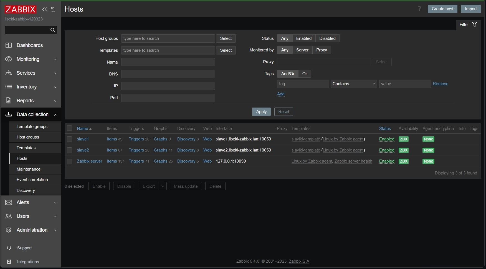
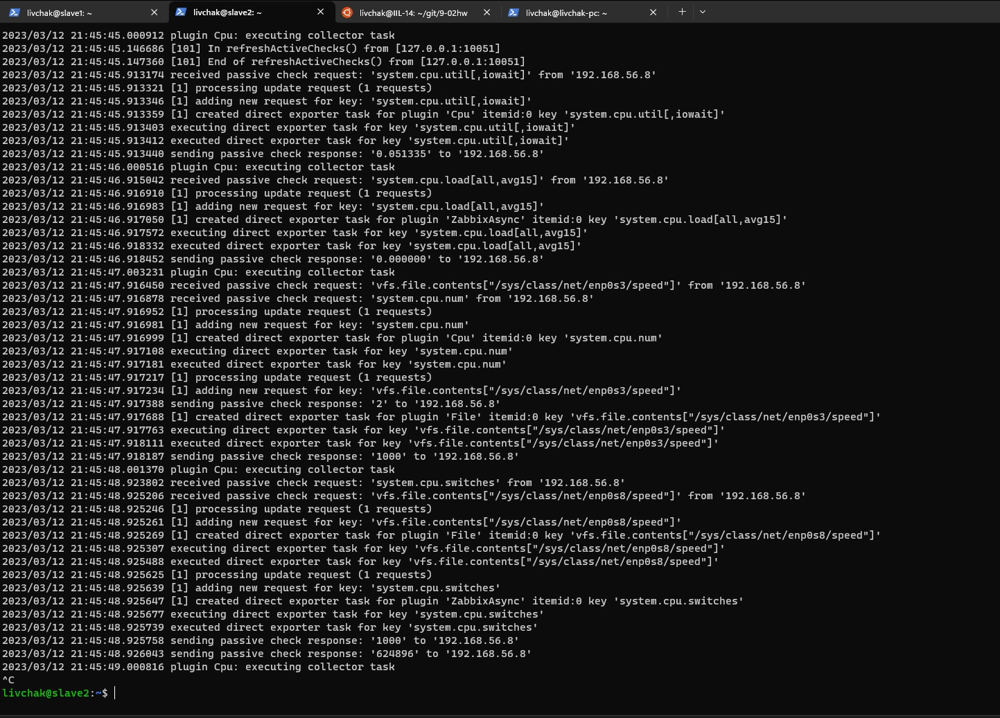
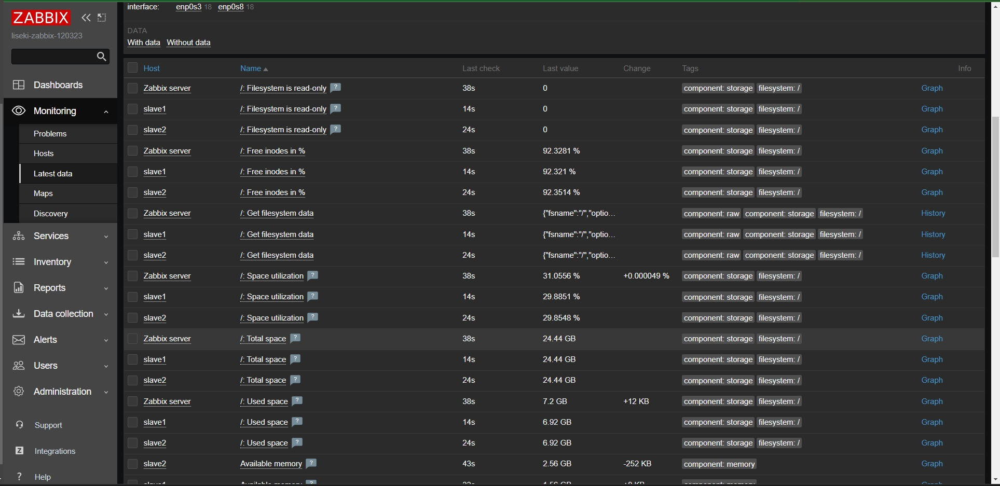
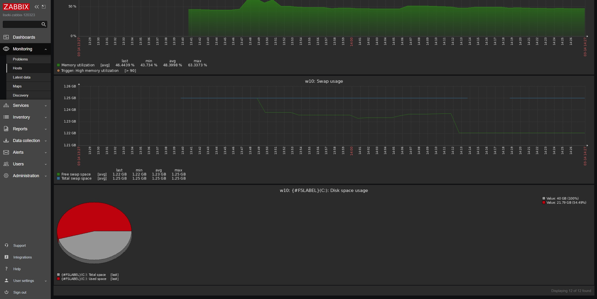

# Домашнее задание к занятию "`9-02hw`" - `Ливчак Серей`


---

### Задание 1

`Установите Zabbix Server с веб-интерфейсом.`

1. `Админка Zabbix`
**Скриншот 1-1_1**


2. `команды исполнения`
<details>
<summary>Скриншот</summary>

**Скриншот 1-1_1+** 


</details>

```

44  apt update  
45  sudo apt update  
46  sudo apt upgrade  
47  exit  
48  wget https://repo.zabbix.com/zabbix/6.4/ubuntu/pool/main/z/zabbix-release/zabbix-release_6.4-1+ubuntu22.04_all.deb  
49  ls  
50  dpkg -i zabbix-release_6.4-1+ubuntu22.04_all.deb  
51  sudo dpkg -i zabbix-release_6.4-1+ubuntu22.04_all.deb  
52  sudo apt update  
53  ls  
54  dpkg -i zabbix-release_6.4-1+ubuntu22.04_all.deb  
55  sudo apt search  
56  sudo apt search zabbix  
57  apt install postgresql  
58  sudo apt install postgresql  
59  sudo apt install zabbix-server-pgsql zabbix-frontend-php php8.1-pgsql zabbix-nginx-conf zabbix-sql-scripts zabbix-agent  
60  sudo -u postgres createuser --pwprompt zabbix  
61  sudo -u postgres createdb -O zabbix zabbix  
62  zcat /usr/share/zabbix-sql-scripts/postgresql/server.sql.gz | sudo -u zabbix psql zabbix  
63  sudo nano /etc/zabbix/zabbix_server.conf  
64  sudo systemctl restart zabbix-server.service  
65  sudo systemctl status zabbix-server.service  
66  cat /var/log/zabbix/zabbix_server.log  
67  sudo nano /etc/zabbix/nginx.conf  
68  systemctl restart nginx.service  
69  sudo systemctl restart nginx.service  
70  sudo systemctl status nginx.service  
71  ip a  
72  sudo systemctl restart zabbix-server zabbix-agent nginx php8.1-fpm  
73  sudo systemctl enable zabbix-server zabbix-agent nginx php8.1-fpm  
74  history  

```


---

### Задание 2

`Установите Zabbix Agent на два хоста.`

1. `Cкриншот раздела Configuration > Hosts, где видно, что агенты подключены к серверу.`

**Скриншот 2-1_1**



2. `Cкриншот лога zabbix agent, где видно, что он работает с сервером`

**Скриншот 2-2_1** установил debuglevel 4 и собрал данные


3. `Скриншот раздела Monitoring > Latest data для обоих хостов`

**Скриншот 2-3_1**


4. `текст использованных команд на машинах с заббикс агентом`
```
82  ls  
83  wget https://repo.zabbix.com/zabbix/6.4/ubuntu/pool/main/z/zabbix-release/zabbix-release_6.4-1+ubuntu22.04_all.deb  
84  dpkg -i zabbix-release_6.4-1+ubuntu22.04_all.deb  
85  sudo dpkg -i zabbix-release_6.4-1+ubuntu22.04_all.deb  
86  sudo search zabbix  
87  apt search zabbix  
88  sudo apt update  
89  apt search zabbix  
90  sudo apt install zabbix-agent2 zabbix-agent2-plugin-*  
91  apt list --installed | grep zabbix  
92  tail -f /var/log/zabbix/zabbix_agent2.log  
93  sudp nano /etc/zabbix/zabbix_agent2.conf  
94  sudo nano /etc/zabbix/zabbix_agent2.conf  
95  sudo systemctl restart zabbix-agent2.service  
96  tail -f /var/log/zabbix/zabbix_agent2.log  
97  history  

```


---

### Задание 3

`скриншот раздела Latest Data, где видно свободное место на диске C:`

**Скриншот 3-1_1**

