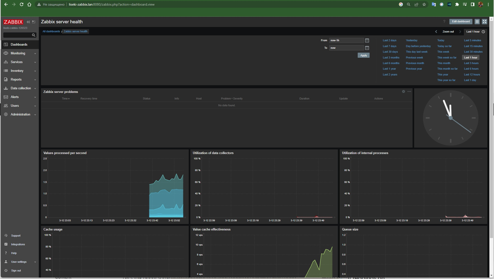
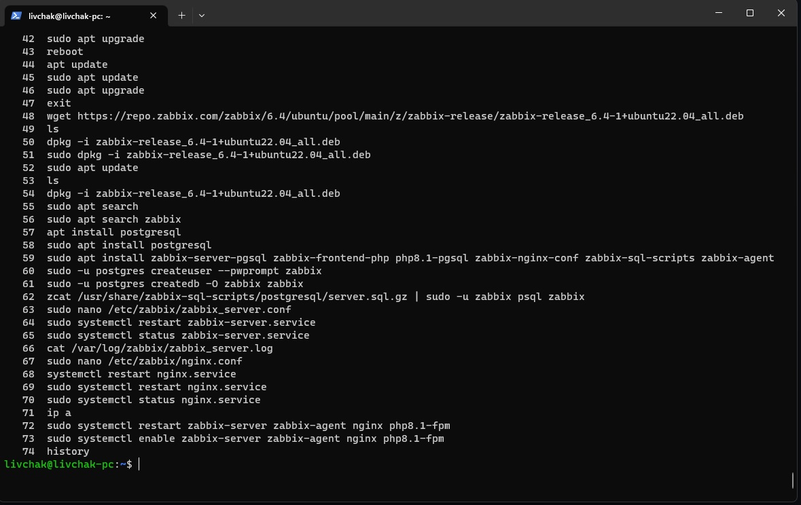

# Домашнее задание к занятию "`9-02hw`" - `Ливчак Серей`


---

### Задание 1

`Установите Zabbix Server с веб-интерфейсом.`

1. `Админка Zabbix`
**Скриншот 1-1_1**


2. `команды исполнения`
<details>
<summary>Скриншот</summary>

**Скриншот 1-1_1+** 


</details>
```
      44  apt update
      45  sudo apt update
      46  sudo apt upgrade
      47  exit
      48  wget https://repo.zabbix.com/zabbix/6.4/ubuntu/pool/main/z/zabbix-release/zabbix-release_6.4-1+ubuntu22.04_all.deb
      49  ls
      50  dpkg -i zabbix-release_6.4-1+ubuntu22.04_all.deb
      51  sudo dpkg -i zabbix-release_6.4-1+ubuntu22.04_all.deb
      52  sudo apt update
      53  ls
      54  dpkg -i zabbix-release_6.4-1+ubuntu22.04_all.deb
      55  sudo apt search
      56  sudo apt search zabbix
      57  apt install postgresql
      58  sudo apt install postgresql
      59  sudo apt install zabbix-server-pgsql zabbix-frontend-php php8.1-pgsql zabbix-nginx-conf zabbix-sql-scripts zabbix-agent
      60  sudo -u postgres createuser --pwprompt zabbix
      61  sudo -u postgres createdb -O zabbix zabbix
      62  zcat /usr/share/zabbix-sql-scripts/postgresql/server.sql.gz | sudo -u zabbix psql zabbix
      63  sudo nano /etc/zabbix/zabbix_server.conf
      64  sudo systemctl restart zabbix-server.service
      65  sudo systemctl status zabbix-server.service
      66  cat /var/log/zabbix/zabbix_server.log
      67  sudo nano /etc/zabbix/nginx.conf
      68  systemctl restart nginx.service
      69  sudo systemctl restart nginx.service
      70  sudo systemctl status nginx.service
      71  ip a
      72  sudo systemctl restart zabbix-server zabbix-agent nginx php8.1-fpm
      73  sudo systemctl enable zabbix-server zabbix-agent nginx php8.1-fpm
      74  history
```


---

### Задание 2

`Приведите ответ в свободной форме........`

1. `Заполните здесь этапы выполнения, если требуется ....`
2. `Заполните здесь этапы выполнения, если требуется ....`
3. `Заполните здесь этапы выполнения, если требуется ....`
4. `Заполните здесь этапы выполнения, если требуется ....`
5. `Заполните здесь этапы выполнения, если требуется ....`
6. 

```
Поле для вставки кода...
....
....
....
....
```

`При необходимости прикрепитe сюда скриншоты
`


---

### Задание 3

`Приведите ответ в свободной форме........`

1. `Заполните здесь этапы выполнения, если требуется ....`
2. `Заполните здесь этапы выполнения, если требуется ....`
3. `Заполните здесь этапы выполнения, если требуется ....`
4. `Заполните здесь этапы выполнения, если требуется ....`
5. `Заполните здесь этапы выполнения, если требуется ....`
6. 

```
Поле для вставки кода...
....
....
....
....
```

`При необходимости прикрепитe сюда скриншоты
`

### Задание 4

`Приведите ответ в свободной форме........`

1. `Заполните здесь этапы выполнения, если требуется ....`
2. `Заполните здесь этапы выполнения, если требуется ....`
3. `Заполните здесь этапы выполнения, если требуется ....`
4. `Заполните здесь этапы выполнения, если требуется ....`
5. `Заполните здесь этапы выполнения, если требуется ....`
6. 

```
Поле для вставки кода...
....
....
....
....
```

`При необходимости прикрепитe сюда скриншоты
`

---
## Дополнительные задания (со звездочкой*)

Эти задания дополнительные (не обязательные к выполнению) и никак не повлияют на получение вами зачета по этому домашнему заданию. Вы можете их выполнить, если хотите глубже и/или шире разобраться в материале.

### Задание 5

`Приведите ответ в свободной форме........`

1. `Заполните здесь этапы выполнения, если требуется ....`
2. `Заполните здесь этапы выполнения, если требуется ....`
3. `Заполните здесь этапы выполнения, если требуется ....`
4. `Заполните здесь этапы выполнения, если требуется ....`
5. `Заполните здесь этапы выполнения, если требуется ....`
6. 

`При необходимости прикрепитe сюда скриншоты
`
